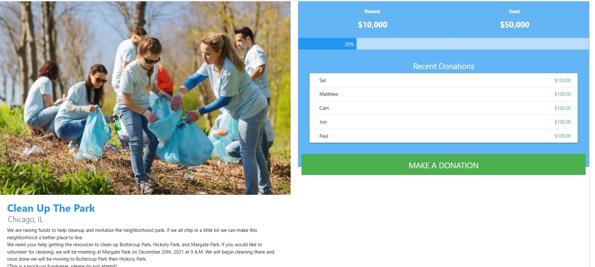

# Helpr

http://aqueous-atoll-40596.herokuapp.com/

https://github.com/j-goldrath/group-project-3

# Table of Content
[Description](#Description)

[Installation](#Installation)

[Technologies](#Technologies)

[Usage](#Usage)

[License](#License)

[Contact](#Contact)

[Contribution](#Contribution)

## Description

Helpr is a website that features and allows for creation of fundraisers that focus towards cleaning and bettering the world.

### Inspiration

It is estimated that over 1 million marine animals are killed each year due to plastic debris in our oceans. It is also estimated that at least 100,000 land animals die from human litter annually.

We believe that this is unjust, not only for the animals, but for humans as well. All communities should have access to clean resources, whether that's a clean beach to swim in, a clean park to take children to, or just walking on a clean sidewalk. We saw that things were being done in a large-scale, and while we support that, we wanted a place for smaller communities to get support as well. 

## Installation
Run 'npm install' in your terminal

## Technologies

React

Graphql

Apollo-Client

Mongoose

Stripe

Bcrypt

JSON Web Token

## Usage
Run 'npm run develop' in your terminal to use via localhost

or

Use the deployed Heroku link above

Upon visiting the website, you can sign up or login if you're a returning user via the dropdown button on the navbar. On a mobile device you can access sign up and login by clicking on the hamburger menu on the left side of the nav.

On the homepage you will see two different types of fundraisers. 

The first type of fundraiser you'll see are fundraisers made via our app. This is an example of one:

You can see the title of the fundraiser, where it'll take place, the donation goal, and a donate button. The card as a whole is clickable and will redirect you to a page with more information on the fundraiser.

Here you can see the same details, but you can also see the recent donators. Upon clicking the donate button either on the homepage or the info page, you will be redirected to a page where you could declare how much you would like to donate to the fundraiser. 

You'll declare how much you would like to donate in the text field labelled "$ Amount". After declaring the amount you would like to donate, you can click on the donate button to donate, or if you change your mind, you can click on the cancel button to be redirect to the homepage.

The second type of fundraisers on our app are large-scale, non-profit fundraisers or charities that we ourselves believe are doing good for the world. They have the same display as fundraisers created on our page. 

The difference between these fundraisers and ones created on our website is that clicking on the card or the donate button on these will redirect you to the official website of the fundraiser. 

To create a fundraiser on our app, on the right side of the navbar there is a "Create a Fundraiser" option that will redirect you to a form to create a fundraiser. On mobile you'll be able to access this by clicking on the hamburger menu on the left side of the nav.

All you have to do is fill out the information and click create. This will redirect you to the home page where your fundraiser will render as well. 

At any location on the site, if you click, "Helpr" on the navbar, you will be return to the homepage.

(App is not yet fully functional)

## License

## Contact
Matthew Nguyen:

https://github.com/mnguyen14

Email: matthewnguyen0814@gmail.com

Jonathan Goldrath:

https://github.com/j-goldrath

Email:

Salvador Ayon:

https://github.com/ayonsa60

Email: 

Cameron Mcdougall:

https://github.com/CJMc0d3

Email: 

## Contribution

For any contribution or questions, please create an issue.